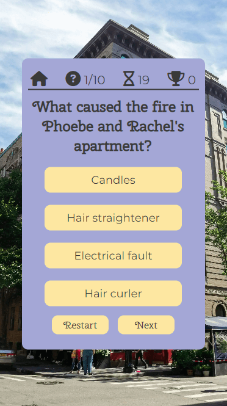
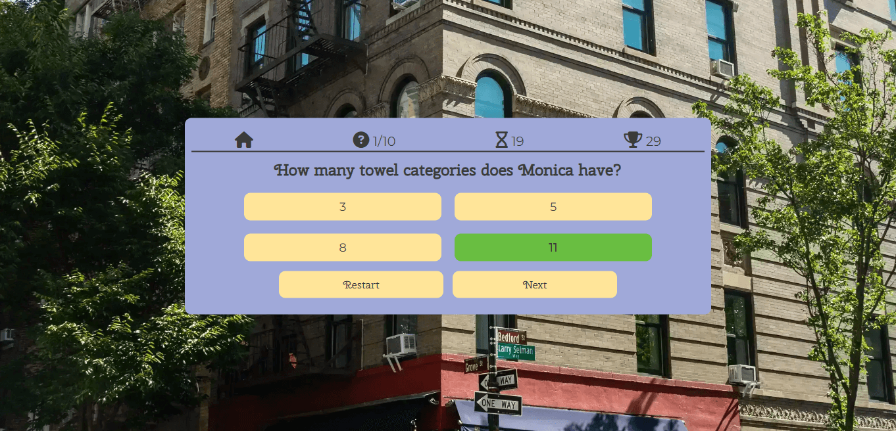
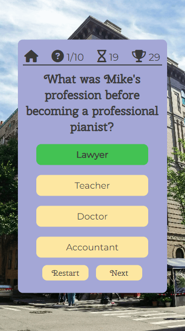
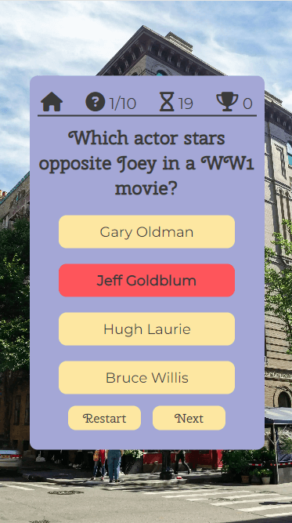
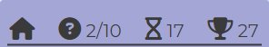

# Friends Quiz
'The One with the Ultimate Friends Quiz' is a multiple choice quiz for those interested in the TV show 'Friends'. Each game consists of 10 questions, with a 20 second timer for each question, with points being awarded for correct answers and how quickly those questions were answered, making this a game of both speed and 'Friends' knowledge.

[View the live site here](https://s-batish.github.io/friends-quiz/)
## User Experience
### Site Owner's Goals
- To create an interactive online quiz to test users on their knowledge of the TV show 'Friends'
- To enable users to compete against their friends and family through the High Scores section, which makes it easy for users to see their previous scores and improve
- To provide a fully responsive quiz that can be played on a range of devices
### External User's Goals
- To play a fun and interactive online quiz to test their 'Friends' knowledge
- To save their high scores to improve when they play again
- To have clear instructions about the rules of the game and how the scoring works
- To easily navigate the site and to have a way to return to the Home page at any point of the quiz
## Design
### Wireframes
Balsamiq wireframes were created for mobile, tablet and desktop devices to show the structure and overall design of each page of the quiz.

[Home page wireframe](docs/wireframes/homepage.png)

[Rules page wireframe](docs/wireframes/rules-page.png)

[Questions page wireframe](docs/wireframes/questions-page.png)

[End page wireframe](docs/wireframes/end-page.png)

[High scores page wireframe](docs/wireframes/high-scores-page.png)

### Colour Scheme
The purple and yellow colours have been used because of their connotations with the TV show 'Friends' and so have been chosen to tie into the theme of the quiz and also because they would be instantly recognisable colours to a fan of the programme.
### Typography
- The font 'Gloria Hallelujah' has been used for the title of the quiz because of its similarity to the 'Friends' logo.
- 'Cherry Swash' has been used for the headings, buttons and questions, and 'Montserrat' has been used for the answers and paragraph elements because they complement each other quite well and create an easy to read, but visually appealing quiz.
## Features
This quiz has been designed to be both entertaining and easy to use, and as such, the features that have been implemented across the game support this objective.
### Home page
-  This is what the user will be greeted with upon opening the quiz, and also what they will return to any time they click a button to return Home.
- It is an easy to navigate Home page, with the title of the quiz at the top, and 3 buttons below:
    
    - A Play button to start the quiz
    - A how to play button to take the user to the rules of the game
    - A High Scores button to take the user to the high scores page

Desktop home page

Mobile home page

### How to play section
- This section gives the user clear instructions about how the game works, including how many questions there are, how many seconds the user has to answer each question, and how the user's scores will be incremented.
- There is also a Home button at the bottom to allow the user to return to the Home page.

Desktop how to play section

Mobile how to play section

### High scores section
- This page displays the top 5 high scores in order from the highest at the top, to the 5th highest at the bottom.
- As the scores are only saved to local storage, users can only compete with those who play on the same device.
- There is a Clear high scores button which will clear the local storage and reload the window, taking the user back to the home page once this is clicked.
- The user can also move their mouse over each of the high scores which will enlarge them slightly as the mouse is hovering over it, which draws a bit more attention to the high score that the user is looking at.

Desktop high scores page

Mobile high scores page

### Quiz section
- When the user presses the play button they will be taken to the main quiz area, which displays 1 random question from the quizQuestions array and the 4 corresponding answer buttons.
- Below the answer buttons there is a Next button, which the user has to click to go to the next question, and a Restart button, which restarts the quiz, resetting the question counter to 1 and the timer and score to 0.

Desktop quiz section

Mobile quiz section

- If the user answers the question correctly, the answer button that they clicked on will change colour to green, and all of the answer buttons will become disabled, preventing the user from clicking on them.

Desktop correct answer

Mobile correct answer

- If the user answers the question incorrectly, the answer button that they clicked on will change colour to red, and all of the answer buttons will become disabled, preventing the user from clicking on them.

Desktop incorrect answer

Mobile incorrect answer

#### Info bar
- The info bar on the quiz section has 4 font awesome icons to represent different functions on the quiz:

    - The home icon is a button that takes the user back to the Home page
    - The question mark icon displays the question number that the user is on out of the maximum number of questions
        - The maximum number of questions displayed in the quiz can be changed by changing the number in the maxQuestions variable in the script.js page.
    - The timer icon is a timer that counts down from 20 seconds on each question
    - The trophy icon tells the user the total amount of points they have scored during the quiz. This number is calculated by giving the user 10 points for the correct question and adding the time that they have remaining on the timer once they have answered the question.
        - The amount of points given for a correct answer (in this case 10 points) can be changed by changing the number in the correctPoints variable in the script.js page.

Desktop info bar

Mobile info bar

### End page section
- Once the user finishes the quiz they are automatically taken to the end page that tells them how many questions they answered correctly and how many points they got.
- Below this there is a space for the user to add their username in order to save their scores to the High Scores page. The username input has a required attribute which means the user cannot click the Save high scores button without inputting a username. A custom validity has also been added to present the user with a message telling them to input their username.

Desktop username input

Mobile username input

- Below the username input area there are three buttons
    - A Save High Score button which saves the user's high score and takes them to the High Scores page
    - A Play again button which restarts the quiz
    - A Home button which takes the user back to the home page

Desktop End page

Mobile End page

### 404 page
- The 404 page has been included in case the user directs to a broken link. It has a return home button to take the user back to the main home page without the need to click the back button on their browser.

Desktop 404 page

Mobile 404 page

## Technologies
- HTML
    - Used to create the structure of the quiz
- CSS
    - Used to implement styling across the quiz
- JavaScript
    - Used to create interactivity throughout the quiz
- Gitpod
    - Used to develop and edit the code
- Git
    - Used to add, commit and push the code
- Github
    - Used to store and deploy the code
- [Balsamiq](https://balsamiq.com/)
    - Used to create wireframes
- [Google Fonts](https://fonts.google.com/)
    - Used to import fonts
- [Font Awesome](https://fontawesome.com/icons)
    - Used icons from this website as the icons on the main quiz page
- [Fontjoy](https://fontjoy.com/)
    - Used to create the font pairings used on the website
- [TinyPNG](https://tinypng.com/)
    - Used to reduce the size of the background image
- [Favicon](https://favicon.io/)
    - Used to create a favicon
## Testing
### Responsiveness
- The website has been tested on Chrome, Edge and Firefox as well as on an iPhone 11, iPhone 13 mini, Samsung Galaxy S22, and iPad 6th Generation in order to check the responsiveness on different devices and different browsers.
- Each section of the quiz was also tested on the [Responsive Design Checker website](https://responsivedesignchecker.com/), and on Chrome and Firefox developer tools, to ensure that the quiz is responsive on a range of mobile, tablet and desktop devices.
### Accessibility
### Validator Testing
### Lighthouse Testing
### Manual Testing
### Testing User Stories
### Solved Bugs
## Deployment
- The website was deployed to Github pages. The steps to deploy are as follows:
    - Login to Github and find the Github repository 'Friends Quiz'
    - Click on the 'Settings' button at the top of the repository
    - Click on 'Pages' on the left hand side navigation menu
    - Select 'Deploy from a branch' under 'Source' if this is not already selected
    - Under the 'Branch' drop down menus, select 'main' and 'root'
    - Click 'Save'
    - Once the page refreshes, the live link should appear underneath the 'Github Pages' title
The live link can be found here: 
## Credits
### Content
- The quiz questions and answers were written by myself, with inspiration from the book 'Mental Perk A Friends Quiz Book'.
- The fonts were chosen with [Font Joy](https://fontjoy.com/).
- The icons at the top of the main quiz page are from [Font Awesome](https://fontawesome.com/icons).
- The favicon is from [Favicon](https://favicon.io/).
### Media
- The background image is from [Unsplash](https://unsplash.com/).
### Code